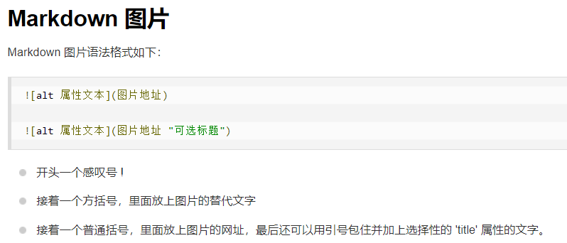

<!-- 比如 -->
#  一级
## 二级
### 三级
#### 四级
##### 五级
###### 六级

# code 安装插件：
## Markdown All in One
## ctrl + k 松手 按v  预览
## Markdown图片语法



# 1新建脚手架项目 demo131
## shift+powershell
## vue create demo131
# 2引入路由
```
 vue add router
```
# 3 安装element ui
```
npm install element-plus --save
```
## 全局引入在 main.js 增加
```
import ElementPlus from 'element-plus';

import 'element-plus/dist/index.css';
```
## 查阅官网文档 element ui

# 记录 ESLint 检查代码工具
#  vite 和 vue cli 是构建工具


# -----------------------------


## 启动Spring boot

#### 安装node.js

```
dnf install nodejs
```

#### 安装pm2

```
npm install pm2 -g
```

#### 编写启动文件 pm2.json

```json
{
  "name": "api",
  "script": "/usr/bin/java",
  "args": ["-jar", "PatientCommunication-0.0.1-SNAPSHOT.jar"],
  "exec_interpreter": "",
  "exec_mode": "fork"
}
```

#### 启动

```
pm2 start pm2.json
```


# ------------

# 服务器安装 java
```
dnf list java*
dnf install java-17-openjdk.x86_64 
```

# 照顾者 区别在于
##  学习--条件
##  连接--条件相关论坛

# 调研（背景调研）
# 1目前主流网站哪些  应用多 就诊网上查  小症状自我诊断
# （技术调研） 
#  技术 框架 框架应用是否广泛  开发提供便利 程序员快速开发

